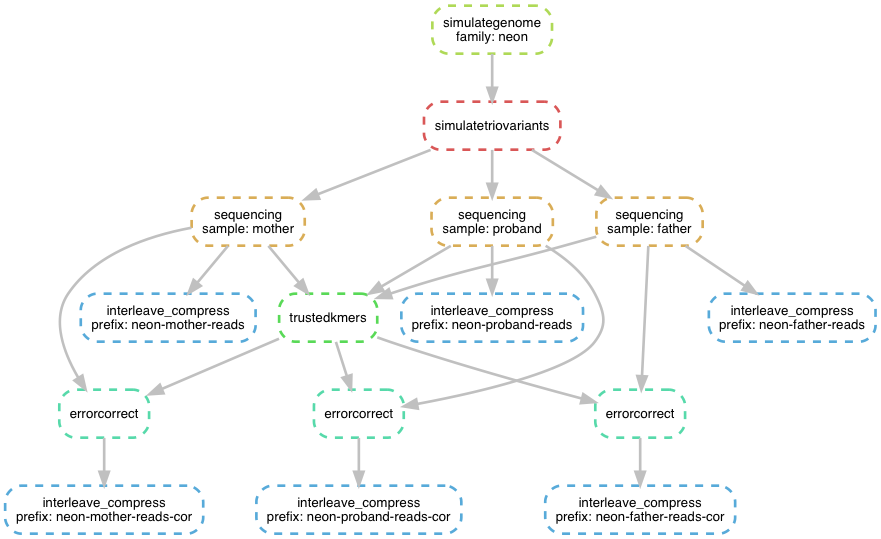

# Noble Trios: simulated pedigrees for benchmarking *de novo* variant discovery methods

[](https://quay.io/repository/standage/noble)


## Synopsis

### Motivation

Modeling genome sequences realistically is incredibly complicated, and most simulations are gross oversimplifications of many features observed in real data.
Nevertheless, there is tremendous value, espcially while developing new methods, in frequently evaluating performance on a data set where the "correct" answers are known.
While the true test of a method is its accuracy with real sequence data, experience demonstrates that even trivially small simulated data sets can reveal bugs in software and bring erroneous assumptions to the fore.
Deliberately small data sets can also be processed in much less time with fewer computational resources, enabling continuous testing strategies not feasible with large data sets.

### Availability

The Noble Trios is a collection of simulated pedigrees created for assessing the performance of *de novo* variant discovery methods.
Each trio is derived from a randomly generated genome sequence with a septanucleotide composition equivalent to that of the human genome.
From this "reference" sequence, shared (inherited) and unique (*de novo*) genomic variants are simulated for three hypothetical individuals: a mother, father, and child.
For each trio this data set furnishes a Fastq file containing simulated 2x100bp paired-end Illumina reads providing 30x coverage of each sample, as well as a VCF file annotating the locations of the shared and unique variants.

Sequence data and variant annotations can be obtained anonymously from the Open Science Framework at https://osf.io/anr56/.
Full disclosure of the pipeline used to produce the data set is available at https://github.com/standage/noble.


## Meet the Nobles

|  Trio name  |  Genome size  |  # Shared variants  |  # Unique (*de novo* in proband) variants  |
|-------------|---------------|---------------------|--------------------------------------------|
|  helium     |  2.5 Mbp      |  100                |  5                                         |
|  neon       |  25 Mbp       |  200                |  10                                        |
|  argon      |  250 Mbp      |  300                |  12                                        |
|  krypton    |  2.5 Gbp      |  750                |  60                                        |


## Manifest

- `Snakefile`: the simulation procedures were executed as a [Snakemake](http://snakemake.readthedocs.io) workflow
- `noble.json`: configuration for the Snakemake workflow
- `Dockerfile`: detailed description of the software configuration environment used to execute the workflow
- `human.order6.mm`: initial states and transition states of an 6th-order Markov model of nucleotide composition, used for simulating genome sequences


## Workflow and Implementation

The figure below summarizes the workflow invoked for each trio.



- `simulategenome`: The [nuclmm](https://github.com/standage/nuclmm) package is used to simulate a haploid "reference" genome sequence.
- `simulatetriovariants`: The [kevlar](https://github.com/dib-lab/kevlar) library is used to simulate shared and unique variants with respect to the reference for a hypothetical trio and to produce a diploid genome sequence for each individual.
- `sequencing`: The [wgsim](https://github.com/lh3/wgsim) tool is used to simulate Illumina whole genome shotgun sequencing of each individual's genome with an effective error rate of approximately 1%.
- `trustedkmers`: As a preliminary error correction step, *k*-mers from all 3 samples are analyzed using [Lighter](https://github.com/mourisl/Lighter) to determine "trusted" *k*-mers in the data set.
- `errorcorrect`: Using the "trusted" *k*-mers, Lighter is again used to correct sequencing errors in the read data sample-by-sample.
- `interleave_compress`: Finally, standard shell tools are used to interleave and compress the paired read files.

The following guide provides commands to show and execute the workflow.

```bash
# Do a "dry-run": show the commands that will be executed to create the "helium" trio
snakemake --configfile noble.json -np helium-{mother,father,proband}-reads-cor.fq.gz

# Actually execute the commands to create the "helium" trio
snakemake --configfile noble.json -p helium-{mother,father,proband}-reads-cor.fq.gz

# Create the "neon" trio, allowing up to 4 commands to run simultaneously
snakemake --configfile noble.json --jobs 4 -p neon-{mother,father,proband}-reads-cor.fq.gz

# Create all trios
snakemake --configfile noble.json --jobs 4 -p {helium,neon,argon,krypton}-{mother,father,proband}-reads-cor.fq.gz
```

Generating the helium and neon trios requires only a few minutes of runtime.
The argon and krypton trios requires a few hours.
